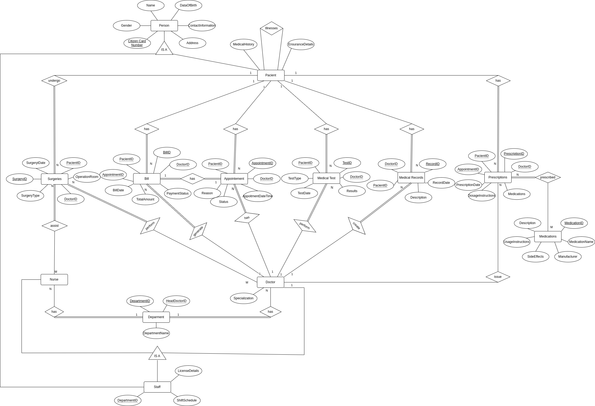
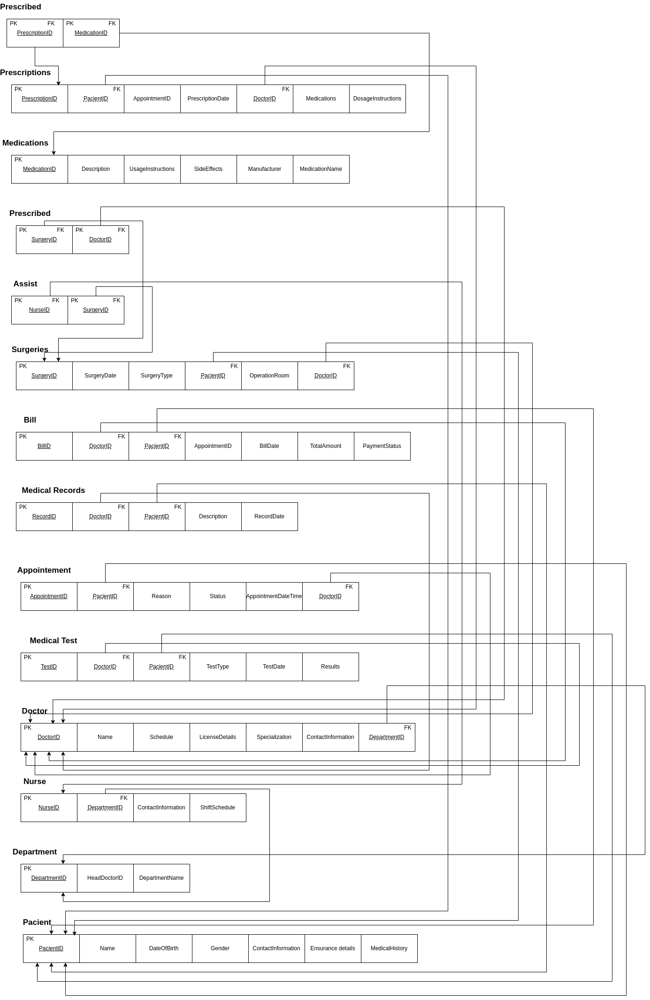

# BD: Trabalho Prático APFE

**Grupo**: P10G10
- Paulo Macedo, MEC: 102620 
- Bernardo Marujo, MEC: 107322 

## Introdução / Introduction

Este sistema de gestão é uma plataforma para lidar com aspetos da administração de saúde, cuidados com pacientes e práticas médicas.

## ​Análise de Requisitos / Requirements

**1. Requisitos Funcionais:**

- **Registo de Pacientes:**
  - O sistema deve permitir o registo de pacientes, incluindo informações como nome, data de nascimento, género, informações de contacto, histórico médico e detalhes do seguro.

- **Registo de Médicos:**
  - Deve ser possível registar médicos com detalhes como nome, especialização, informações de contacto, agenda, qualificações e detalhes da licença.

- **Marcação de Consultas:**
  - Os pacientes devem poder marcar consultas com médicos disponíveis em datas e horários específicos.
  - O sistema deve permitir que os médicos visualizem e gerenciem as suas agendas de consulta.

- **Prescrições Médicas:**
  - Os médicos devem poder prescrever medicamentos aos pacientes, fornecendo detalhes como data da prescrição, medicamentos e instruções de dosagem.
  - O sistema deve associar as prescrições às consultas correspondentes.

- **Realização de Exames Médicos:**
  - Os médicos devem poder solicitar exames médicos para os pacientes, especificando o tipo de teste necessário.
  - O sistema deve registar os resultados dos testes e quaisquer observações relevantes.

- **Faturação:**
  - O sistema deve gerar faturas para os pacientes com base em consultas, exames e outros serviços prestados.
  - Deve ser possível registar o estado de pagamento das faturas (pago ou não pago).

- **Registo de Dados Médicos:**
  - O sistema deve permitir o registo de vários tipos de registos médicos, como notas de consulta, notas de progresso e relatórios de laboratório.
  - Os registos devem ser associados aos pacientes e médicos correspondentes.

- **Gestão de Departamentos:**
  - Deve ser possível registar e gerir os diferentes departamentos médicos, atribuindo um médico chefe a cada departamento.

**2. Requisitos Não Funcionais:**

- **Segurança:**
  - O sistema deve garantir a segurança dos dados do paciente, médico e outros dados sensíveis, implementando medidas de segurança como criptografia, controlo de acesso e auditoria de dados.
  
- **Usabilidade:**
  - A interface do utilizador deve ser intuitiva e fácil de usar, tanto para pacientes quanto para profissionais de saúde.
  
- **Desempenho:**
  - O sistema deve ser capaz de lidar com uma carga de trabalho significativa, garantindo tempos de resposta rápidos e eficiência operacional.
  
- **Conformidade com Regulamentações:**
  - O sistema deve estar em conformidade com as regulamentações de saúde, como HIPAA (Health Insurance Portability and Accountability Act), garantindo a privacidade e segurança das informações do paciente.

- **Disponibilidade:**
  - O sistema deve estar disponível 24 horas por dia, 7 dias por semana, garantindo acesso contínuo aos dados de saúde quando necessário.

- **Escalabilidade:**
  - O sistema deve ser capaz de escalar conforme necessário para lidar com o crescimento do número de pacientes, médicos e registos médicos.

## DER

## ER

