# SIO Project

### Second Delivery


---

## Index

1. Introduction

2. Overview

3. Issues Fixed

4. Conclusion

---

## 1. Introduction
This report details the security enhancements implemented to strengthen our previously designed website, aligning with the Application Security Verification Standard (ASVS). Following a thorough assessment, numerous vulnerabilities were identified, necessitating strategic interventions to bolster the website's defenses. However, in accordance to the project's goal, we prioritized the resolution of 10 key issues, requiring careful consideration in our selection process. This document emphasizes the specific ASVS-related concerns addressed and the comprehensive measures taken to mitigate these vulnerabilities. 

## 2. Overview
To implement this website we used python with cherrypy and SQLite3 for the backend; HTML, CSS and Boostrap with a template for the frontend.

---

## 3. Issues Fixed

We will start by addressing the three software features required.

### Password strength evaluation: requiring a minimum of strength for passwords according to V2.1, with breach verification using an external service;

#### Explanation
Password strength is very important aspect in modern web security, we need strong and easy to remember passwords but this usually means that different users are reusing the same passwords or even worse, leaked passwords.

Data leaks are very hard to deal with and might cause a lot of damage to users including those not directly affected by the leak as mentioned above.
To fix/prevent this problems, we can enforce some password requirements and check those same passwords in databases of leaked credentials making sure the new password is actually new to an attacker.

#### Improvements

The original version of this web app does not contain proper password complexity requirements:s never breached before making it a lot more difficult to guess or brute force.

```python
if len(password) < 8:
    return(False, "A password deve ter pelo menos 8 caracteres.")
elif not any(char.isdigit() for char in password) :
    return(False, "A password deve conter pelo menos um numero.")
elif not any(char.isupper() for char in password):
    return(False, "A password deve ter pelo menos uma letra maiuscula.")
elif not any(char.islower() for char in password):
    return(False, "A password deve ter pelo menos uma letra minuscula.")
elif not any(char in special_chars for char in password):
    return(False, "A password deve ter pelo menos um caracter especial [\"$\", \"&\", \"!\"].")
else: 
    return (True, "")
```

This are just some basic password complexity checks but, the newer version contains much more complex security.
The checks fot the new version.

```python
special_chars =  ["$", "&", "!"]
if len(password) < 12 or len(password) > 128:
    return(False, "ATENÇÂO: Espaços consecutivos serão considerados como um só.")
elif not any(char.isdigit() for char in password) :
    return(False, "")
elif not any(char.isupper() for char in password):
    return(False, "")
elif not any(char.islower() for char in password):
    return(False, "")
elif not any(char in special_chars for char in password):
    return(False, "")
else: 
    return (True, "")
```

The new version also checks for breached credentials:

```python
def check_breached_password(password):
    # hash the password with SHA-1
    sha1_password = hashlib.sha1(password.encode()).hexdigest()

    # send request to 'have i been pwned' to receive matching hashes
    similar_passwords = requests.get(f"https://api.pwnedpasswords.com/range/{sha1_password[:5]}")

    if similar_passwords.status_code == 200:
        # parse the response and find out if the password was breached
        for p in similar_passwords.text.split("\n"):
            # get just the password hash
            passwd = p.split(":")[0]

            # check if password hashes match
            if sha1_password.endswith(passwd.lower()):
                # True means that the password was breached
                return True

    return False
```

This makes sure that a new user will make use of a strong password that was never breached before making it a lot more difficult to guess or brute force.

### Issue 2.1.8 with CWE 521

The implementation of a password strength meter is a pivotal security feature that operates at the intersection of technology and human behavior. From a human perspective, the password strength meter serves as a valuable guide for users in creating robust and secure passwords. It provides immediate feedback on the strength of a chosen password, helping users understand whether if their chosen combination of characters is resilient or not.

#### Demonstration
Demonstration of the passwords requirements and breached credentials checks working:
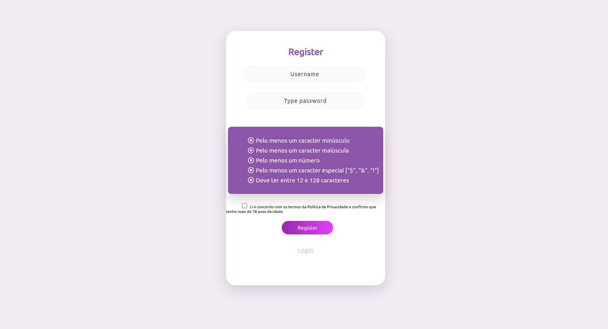

### Multi-factor Authentication (MFA)

### Issue 2.8.1 with CWE 613

Multi-Factor Authentication (MFA) is a critical security measure designed to fortify the traditional login process by requiring users to provide more than one form of identification.
MFA adds an extra layer of defense against cyber threats, typically involving something the user knows (password) and something they possess (e.g., a time-based one-time password or biometric factor).
In this case, we implemented a TOTP that generetes temporary codes.
The time-sensitive nature of these codes significantly enhances security, as they expire after a short period, making it hard for attackar to attemp unauthorized access. Google Authenticator, a widely used app, exemplifies the TOTP approach, allowing users to generate and input these time-dependent codes alongside their traditional password.


Old version of login function without MFA:

```python
def login(nome, password):
    db = sql.connect("database.db")
    
    # Encrypt password with sha256, so that it can be compared with the encrypted password in the database
    password = hashlib.sha256(password.encode()).hexdigest()

    # Check if the password was encrypted correctly
    #print(password)
    
    user = db.execute("SELECT * FROM Users WHERE user = ? AND password = ?", (nome, password)).fetchall()
    if len(user) == 0:
        db.close()
        return False

    db.close()
    return True
```

New secure version of login function with MFA:

```python
    def login(self, nome, password, totp_key):
        db = sql.connect("database.db")
        password_plain = password

        # encrypt password with sha256, so that it can be compared with the encrypted password in the database
        password = hashlib.sha256(password.encode()).hexdigest()

        user = db.execute("SELECT * FROM Users WHERE user = ? AND password = ?", (nome, password)).fetchall()
        if len(user) == 0:
            # password does not match
            db.close()
            return (False, "Username ou palavra-passe errados.")

        if check_breached_password(password_plain):
            # password is breached, inform the user and force them to change their password
            return (False, "A palavra-passe foi encontrada numa violação de dados.\n Por favor, altere-a.")

        totp=db.execute("SELECT key FROM TOTP WHERE username = ?", (nome,)).fetchone()
        if totp == None:
            db.close()
            return (False, "Por favor insira a sua key de TOTP.")

        totp=pyotp.TOTP(self.decrypt(totp[0]))
        db.close()

        if totp.verify(totp_key):
            return (True,)
        else:
            return (False, "Código TOTP errado.")
```

#### Use this code to generate your TOTP codes. It shows upon registration.
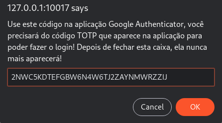

#### On Google Authenticator App 
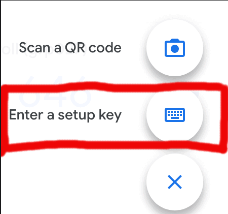

### Encrypted database storage: requiring that critical data is cyphered on the Web application (V6.2, V8.3);

#### Explanation

Encrypting database storage involves converting the stored data into a format that is not easily readable or understandable without the use of a decryption key or algorithm. This process is used to protect sensitive or critical information within a database from unauthorized access or theft.

When a web application employs encrypted database storage for critical data, it means that specific data within the database (such as user credentials, financial information, personal details, etc.) is encrypted before being stored. This encryption ensures that even if someone gains unauthorized access to the database, the information stored within it remains incomprehensible without the appropriate decryption key.

This adds an extra layer of security to the stored data, reducing the risk of a data breach or unauthorized access to sensitive information even if the database itself is compromised.

Empowering users with control over their data is equally vital, allowing them to delete accounts or export data as needed, respecting their rights and ensuring compliance with privacy regulations.

Clear and transparent terms & conditions play a pivotal role, outlining precisely how the application collects, stores, and uses user-provided personal information. User consent, obtained through opt-in mechanisms, ensures that users are fully informed about and agree to the application's data usage.

#### Improvements

### Issue 8.3.1 with CWE 319

In the initial version of our application, there was an oversight in ensuring that sensitive data wasn't being sent to the server via the HTTP message body or headers. Query string parameters from various HTTP verbs potentially contained sensitive data. This posed a security risk as critical information, such as user credentials or personal details, could have been exposed during data transmission.

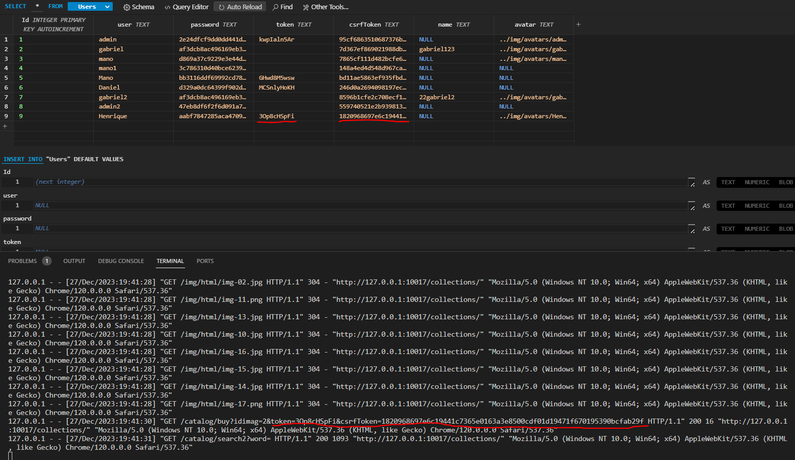

Then we encountered a critical security concern wherein sensitive data was being sent as parameters through GET requests. This approach posed a significant vulnerability as GET requests transmit data through URL parameters, potentially exposing sensitive information

To bolster our security measures, a pivotal improvement was made in the updated version of our application. We strategically transitioned from using the GET request, known for exposing data through URL parameters, to the more secure POST request method. POST requests transmit data within the request body of the HTTP request, as opposed to embedding it in the URL as parameters.

This shift to utilizing POST requests ensured that sensitive data is no longer exposed within the URL and is securely stored in the request body.

**Original Application Code**

```js
$.get("/catalog/buy", { idimag: response.id[index], token: getCookie("token"), csrfToken: csrf_token }, function (response) {
                refresh_quantity(response);
            });
```

**Updated/Secured Application Code**

```js
    $.post({
                url:"/catalog/buy", 
                data:{
                    "idimag": response.id[index],
                    "token": encryptedToken,
                    "csrfToken": csrf_token
                }
            }, function (response) {

                refresh_quantity(response);
            });
```

### Issue 8.3.2 with CWE 212

We introduced a new user-friendly feature allowing account deletion via a button in the profile section, empowering users to manage their accounts directly.
In the backend database progress, we've implemented changes to facilitate the complete deletion of user data. These modifications streamline the process for users wishing to delete their accounts, ensuring data compliance and reinforcing our commitment to robust user data management.

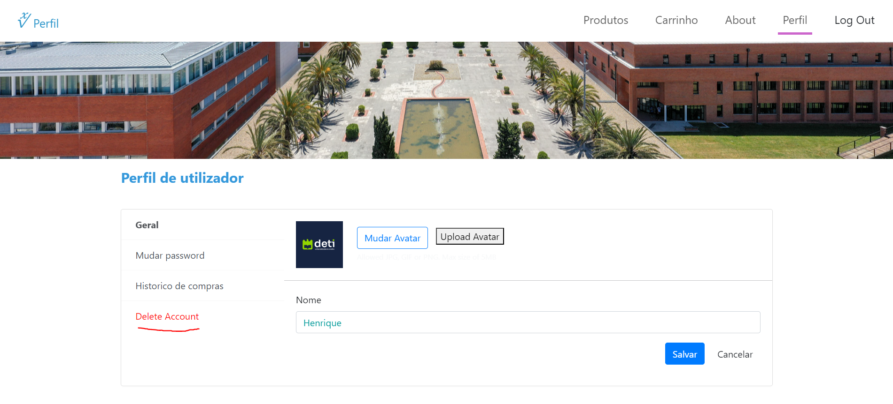

```python	
    @cherrypy.expose
    def deleteAccount(self, token=None, **params):
        if type(token)==list:
            token=token[0]
        token = decryptData(token)  # decryptToken
        if (validToken(token)):
            # Apagar a conta, ou seja, apagar todos os dados do utilizador na DB (incluindo os seus produtos no carrinho e produtos comprados(OrderHistory))
            # Apagar dados na OrderHistory, depois os do UserProducts e por fim a sua conta no Users (isto tudo atraves do userID)

            db = sql.connect("database.db")
            cursor = db.cursor()
            userID = cursor.execute("SELECT Id FROM Users WHERE token = ?;", (token,)).fetchall()[0][0]
            username = cursor.execute("SELECT user FROM Users WHERE token=?;", (token,)).fetchall()[0][0]

            cursor.execute("DELETE FROM OrderHistory WHERE IdUsr = ?;", (str(userID),))

            # Antes de apagar os UserProducts temos de voltar a adicionar os produtos ao stock
            result = getUserProducts(token)

            for product in result:  # [product_name, path, quantity, price,id,productQuantity]
                old_quantity = product[2]
                product_id = product[4]
                productQuantity = product[5]
                cursor.execute("UPDATE Products SET quantity = ? WHERE Id = ?;", (productQuantity+old_quantity,product_id))

            cursor.execute("DELETE FROM UserProducts WHERE UserId = ?;", (str(userID),))
            cursor.execute("DELETE FROM Users WHERE Id = ?;", (str(userID),))
            cursor.execute("DELETE FROM TOTP WHERE username = ?;", (str(username),))

            db.commit()
            db.close()
            deleteToken(token)

            return json.dumps({"deleted": "YES"})
        else:
            return json.dumps({"deleted": "NO"})
```

### Issue 8.3.3 with CWE 285 & Issue 8.3.4 with CWE 200

Addressing critical concerns, we've implemented a mandatory acceptance feature for our Terms & Conditions (a detailed page explicitly explaining the Terms & Conditions has not been developed. However, the mandatory acceptance feature ensures that users acknowledge the existence and relevance of these terms before engaging with the application) within both the login and checkout sessions. This ensures users receive clear information regarding the collection and utilization of their personal data. Before any data usage, users are required to explicitly provide opt-in consent, aligning with privacy regulations and emphasizing our commitment to transparent data practices.

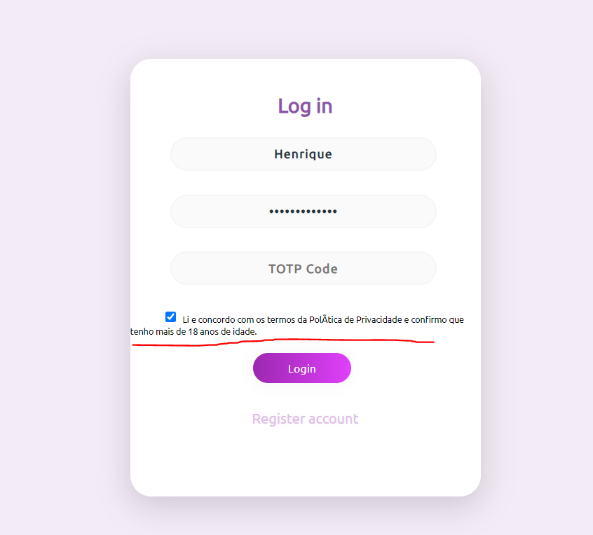
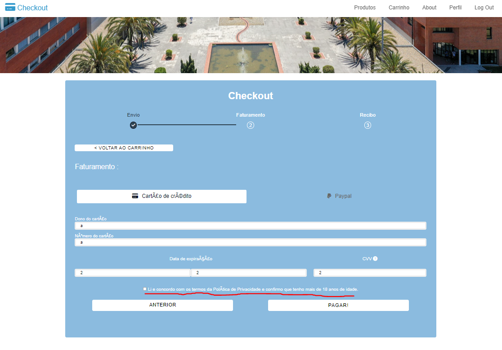

### Now we will be addressing the security issues we fixed.

### Issue 3.2.2 with CWE 331
Insufficient entropy refers to situations where the randomness or unpredictability of generated values is not adequate. In cryptographic contexts, such as key generation or in our case session token generation, having sufficient entropy is crucial to ensuring the security of the system. If the entropy is insufficient, it becomes easier for attackers to predict or guess the generated values, potentially leading to vulnerabilities and security risks.

#### Improvements 
After some calculations we discovered that the original formula used to generate new randow session tokens had insufficient entropy.
#### This has the orginal formula:
```python
    result["token"] = ''.join(random.choice(string.ascii_uppercase + string.digits + string.ascii_lowercase) for _ in range(10))
```
The session tokens where composed of 10 characters, each character being either a lower or upper case letter from the english alphabet [a-z] [A-Z] or a number [0-9].

Using the following formula designed by Claude Shannon to calculate the entropy of randomly generated strings:
#### 
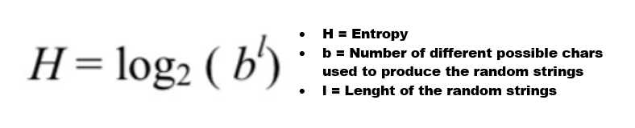
#### We developed the following python script to calculate the entropy of our token generator
```python
import math
import random
import string

hashv = ''.join(random.choice(string.ascii_uppercase + string.digits + string.ascii_lowercase) for _ in range(10))
print(hashv)
    
fb = 26*2+10                       # b [a-z]26 [A-Z]26 [0-9]10
fbl = math.pow(fb, len( hashv ))   # b^l
fH = math.log2(fbl)                # log2(b^l)

print(fH)
```
Unfortunately we got a result of 59, meaning our generated tokens where to similar to each other, not having the minimum 64 bits of entropy established. 
#### To resolved this we incremented the lenght of our tokens from 10 to 12
```python
    result["token"] = ''.join(random.choice(string.ascii_uppercase + string.digits + string.ascii_lowercase) for _ in range(12))
```
Now our session tokens have a entropy of 71 bits.

### Issue 3.7.1 with CWE 778
This type of vulnerability might allow an attacker to perform some action on a users accout after they login, specially if he has physical access to the divice used to login. We already had implemennted secondary verification in attempts of account modification by requiring the user to reinsert the password, but our website being a online shop it should also require secondary verification before performing any sort of transaction, all in a effort to prevent the attackeres of performing unwanted purchases or getting access to sensite data like credit card informations. 

#### Improvements
In this new implementation the website will require the user to reinsert is password before entering the checkout page. Here is the code used to accomplish that:
```js
function check(){
    const input = document.getElementById("pass");
    const encryptedToken = window.encryptData(getCookie("token"));
    $.post({
        url:"/users/reverification", 
        data:{"password": input.value, "token": encryptedToken}
    }).done(function( data ) {
        info = JSON.parse(data)
        if (info.DONE === "NO") {
            alert("Password incorreta");
        } else {
            const modal = document.getElementById("modal2");
            if(modal == null) return;
            modal.classList.remove('active');
            overlay.classList.remove('active');
            redirectToCheckout();
        }
    })
}
```
```python
def reverification(self,token=None,password=None,**params):
        if token == None or password == None:
            raise cherrypy.HTTPRedirect("/collections", status=301)
        else:
            if verify_pass(password,token):
                return json.dumps({"DONE":"YES"})
            else:
                return json.dumps({"DONE":"NO"})

def verify_pass(password, token):
    db = sql.connect("database.db")
    token = decryptData(token)  # decryptToken
    current_password = db.execute("SELECT password FROM Users WHERE token=?;", (token,)).fetchall()
    if len(current_password) == 0:
        return False
    password = hashlib.sha256(password.encode()).hexdigest()
    if password != current_password[0][0]:
        db.close()
        return False
    return True
```
#### Demonstration
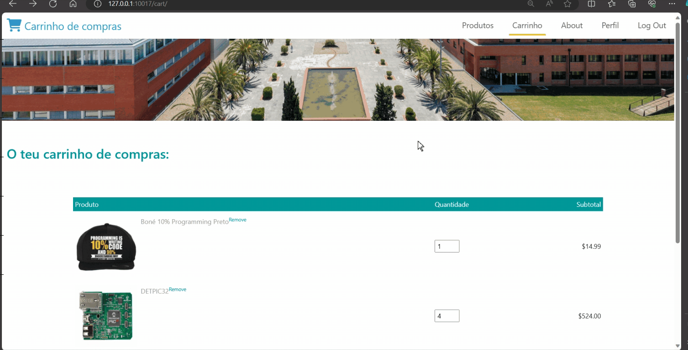

### Issue 5.1.1 with CWE 235

This type of vulnerabiltiy might let attackers change the original values of the parameters passed in the URL, or get information about the server if the errors aren't handled correctly.

We choose to fix this issue because an attacker might change the values that a user inputs (like a password in the worst case scenario), and the user wouldn't even notice it! This would leave the user without access to it's account. 

#### Improvements

To prevent attackers from abusing the addition of new parameters, we have implemented a system that only uses the first parameter of the same name provided and we ignore parameters that are not used:

```python
@cherrypy.expose
    def change_username(self, token=None, newUsername="", **params):   # by adding "**params" to the function parameters, we can handle the extra parameters that attackers might add 
        if type(token)==list:
            token=token[0]
        if token == None:
            raise cherrypy.HTTPRedirect("/collections", status=301)
        if newUsername == "":
            return json.dumps("Por favor insira um username.")
        elif type(newUsername)==list:   # if the attacker tries to use "HTTP parameter pollution" 
            newUsername=newUsername[0]  # we will utilize the first "newUsername" provided in the URL

        db = sql.connect("database.db")
        db.execute("UPDATE Users SET name = ? WHERE token = ?;", (newUsername, token))
        db.commit()
        db.close()
        return json.dumps("Username alterado com sucesso.")
```

The original version of the web app lacked protection against this vulnerability. It would indiscriminately accept all parameters, treating the 'newUsername' parameter as a list, even if there were multiple instances. Consequently, if an attacker injected additional parameters that the function did not request, it would trigger a Cherrypy-powered error.

#### Demonstration

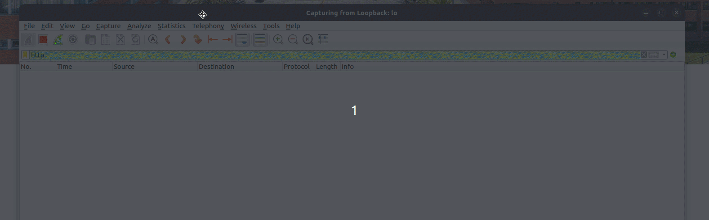

### Issue 12.1.1 with CWE 400

This type of vulnerabiltiy might cause several problems:  

- **Limit storage:** Allowing large file uploads without proper controls could lead to the storage capacity being filled up rapidly (storage exhaustion). This could impact the availability of the application and other services on the same server.

- **DOS:** Accepting very large files could be exploited as a potential vector for denial of service attacks. An attacker might attempt to upload extremely large files, consuming server resources and causing service degradation or unavailability for all legitimate users.

We choose to fix this issue because it impacts users directly with bad performance, glitches, crashes or even unavailability. This would mean that in a real system/company, the image/reputation would be worsened along with the user experience, encouraging them to leave.

#### Improvements

To prevent attackers from abusing the upload system, we have implemented a system that checks for file size:
```js
function uploadAvatar() {
    const avatarInput = document.getElementById("avatar-input");
    const avatarFile  = avatarInput.files[0]; // get the selected file

    if (avatarFile) {
        // check file size before upload
        const maxSizeInBytes = 5 * 1024 * 1024; // 5 MB
        if (avatarFile.size  > maxSizeInBytes) {
            alert("O ficheiro selecionado excede o tamanho máximo (5 MB). Por favor escolha outra imagem.");
            return;
        }

        const formData = new FormData();
        formData.append("newAvatar", avatarFile);

        $.ajax({
            url: "/profile/upload_avatar",
            type: "POST",
            headers: {"X-Filename": avatarFile.name},
            data: formData,
            processData: false,
            contentType: false,
            success: (response) => {
                // handle the response from the server
                const result = JSON.parse(response)
                if (result["DONE"] === "YES") {
                    alert("Upload do avatar foi feito com sucesso.");
                    show_avatar();
                } else {
                    alert(result["ERROR"]);
                }
            }, error: () => {
                // something went wrong
                alert("Upload do avatar foi feito com sucesso.");
            }
        });
    }
}
```

The backend code:
```python
@cherrypy.expose
def upload_avatar(self, newAvatar, **params):
    # check if a token is present
    result = {"DONE": "NO", "ERROR": ""}
    token = cherrypy.request.cookie.get('token')
    if token == None:
        result["ERROR"] = "Token inválido."
        return json.dumps(result)
    elif type(token)==list:
        token=token[0]

    # get the actual token string
    token = token.value

    # check is an Avatar is present
    if newAvatar == "":
        result["ERROR"] = "Por favor selecione uma imagem."
        return json.dumps(result)

    # check the file size
    max_size_in_bytes = 5 * 1024 * 1024  # 5 MB
    content_length = 0
    while True:
        data = newAvatar.file.read(8192)
        if not data:
            break
        content_length += len(data)

        if content_length > max_size_in_bytes:
            result["ERROR"] = "O ficheiro selecionado excede o tamanho máximo (5 MB). Por favor escolha outra imagem."
            return json.dumps(result)

    db = sql.connect("database.db")
    username = db.execute("SELECT user FROM Users WHERE token=?;", (token,)).fetchall()

    # save the image file
    with open('./img/avatars/' + username[0][0] + '.png', 'wb') as f:
        # reset file pointer to the beginning of the file
        newAvatar.file.seek(0)
        while True:
            data = newAvatar.file.read(8192)
            if not data:
                break
            f.write(data)

    result["DONE"] = "YES"
    return json.dumps(result)
```

Originally, the web app did not have any type of protection against this, it would just take the image without making any checks.

#### Demonstration
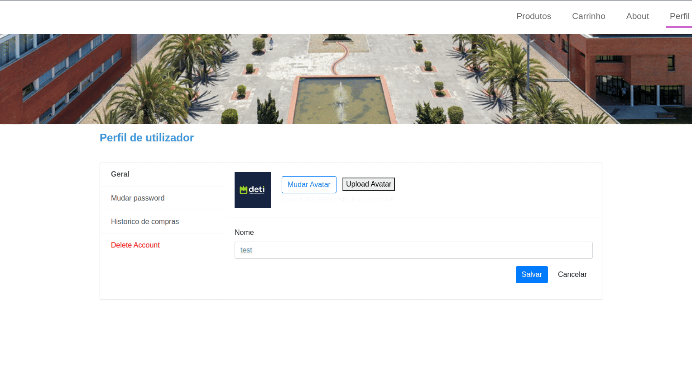


### Issue 13.1.3 with CWE 598 

Preventing the exposure of sensitive information, like session tokens, in API URLs is crucial because it prevents the information from being exposed through various channels and its misuse as well as unauthorized access to a user's account. Another problem would be the increase of the vulnerability to CSRF attacks, where attackers can manipulate URLs to perform unauthorized actions on behalf of authenticated users.

#### Improvements

In order to safeguard sensitive information, we decided to cipher the given parameter before sending it to the server's API and when it reaches, we decipher it.

Function used to encrypt the parameters (present in cookie.js)
```js 
window.encryptData = function(data){
    const secretKey = CryptoJS.enc.Hex.parse("2b7e151628aed2a6abf7158809cf4f3c"); // Convert key to WordArray
  
    const encryptedData = CryptoJS.AES.encrypt(
      CryptoJS.enc.Utf8.parse(data),
      secretKey,
      { mode: CryptoJS.mode.ECB }
    ).toString();
  
    return encryptedData;
  }
```

Function used to decrypt the parameters (present in utils.py)
```python

def decryptData(data):
    data=data.replace(" ", "+")
    #print("DATA ------------------------->",data,len(data))
    if len(data)!= 24:
        return None
    secret_key = binascii.unhexlify('2b7e151628aed2a6abf7158809cf4f3c')

    # Decryption using provided key
    cipher = AES.new(secret_key, AES.MODE_ECB)  # Use the appropriate mode (e.g., CBC, GCM)

    encrypted_data = base64.b64decode(data)
    decrypted_data = unpad(cipher.decrypt(encrypted_data), AES.block_size).decode('utf-8')

    # Now `decrypted_data` holds the new data in plain text
    # Use it as needed (e.g., update in the database)

    # Return a success response to the client
    return decrypted_data
```

And an example of the two functions being used. This is how we change the password in our system
```js
function change_password() {
    let current_password = document.getElementById("CURRENT_PASSWORD").value;
    let new_password = document.getElementById("NEW_PASSWORD").value;

    if (new_password !== document.getElementById("CONFIRM_PASSWORD").value) {
        alert("As palavras-passe não são iguas.");
        return;
    }
    
    // Encrypt the parameters before sending them
    const encryptedToken = window.encryptData(getCookie("token"));
    const encryptedCurrentPassword = window.encryptData(current_password);
    const encryptedNewPassword = window.encryptData(new_password);
    
    $.post( {
        url: "/profile/change_password",
        data: {
        "token": encryptedToken,
        "password": encryptedCurrentPassword,
        "newPassword": encryptedNewPassword
    }, 
    success: function(result) {
        const data = JSON.parse(result);
        if (data["DONE"] === "NO") {
            // something went wrong so tell the user
            alert(data["ERROR"]);
            return;
        } else {
            // everything is ok so tell the user
            alert("A palavra-passe foi alterado com sucesso!");
        }
    }
    });
    
}
```

```python
@cherrypy.expose
    def change_password(self, password="", newPassword="", token=None,**params): # by adding "**params" to the function parameters, we can handle the extra parameters that attackers might add
        if type(token)==list:    # if the attacker tries to use "HTTP parameter pollution" 
            token=token[0]      # we will utilize the first "password" provided in the URL
        token = decryptData(token)  # decryptToken
        if token == None:
            raise cherrypy.HTTPRedirect("/collections", status=301)
        
        result = {"DONE": "NO", "ERROR": ""}

        # check password
        if type(password)==list:  # if the attacker tries to use "HTTP parameter pollution" 
            password=password[0]    # we will utilize the first "password" provided in the URL
        password = decryptData(password)    # decrypt password
        if password == "" or password == None:
            result["ERROR"] = "Insira a sua palavra-passe."
            return json.dumps(result)   
        

        # check new password
        if newPassword == "" or newPassword==None:
            result["ERROR"] = "Insira a nova palavra-passe."
            return json.dumps(result)
        elif type(newPassword)==list:   # if the attacker tries to use "HTTP parameter pollution" 
            newPassword=newPassword[0]  # we will utilize the first "newPassword" provided in the URL
        newPassword = decryptData(newPassword)


        # check if new password meets the requirements
        res = check_password_requirements(newPassword)
        if res[0] == False:
            result["ERROR"] = res[1]
            return json.dumps(result)

        # check if new password was breached before
        if check_breached_password(newPassword):
            result["ERROR"] = "A sua nova palavra-passe foi encontrada numa violação de dados. Por favor mude-a."
            return json.dumps(result)

        db = sql.connect("database.db")
        newPassword = hashlib.sha256(newPassword.encode()).hexdigest()

        # check password by token
        current_password = db.execute("SELECT password FROM Users WHERE token=?;", (token,)).fetchall()

        if len(current_password) == 0:
            result["ERROR"] = "Token inválido."
            return json.dumps(result)

        password = hashlib.sha256(password.encode()).hexdigest()
        if password != current_password[0][0]:
            db.close()
            result["ERROR"] = "Palavra-passe está mal."
            return json.dumps(result)

        # update password
        db.execute("UPDATE Users SET password=? WHERE token=?;", (newPassword, token))

        db.commit()
        db.close()
        result["DONE"] = "YES"
        return json.dumps(result)
```

The original version of the app didn't cipher any data, making it visible to any attacker within the same network, private information like session tokens or passwords by using something simple like wireshark!

#### Demonstration


